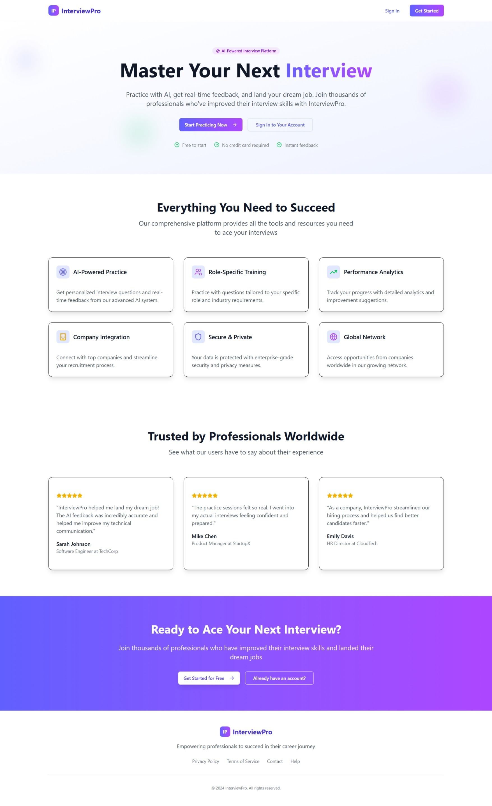
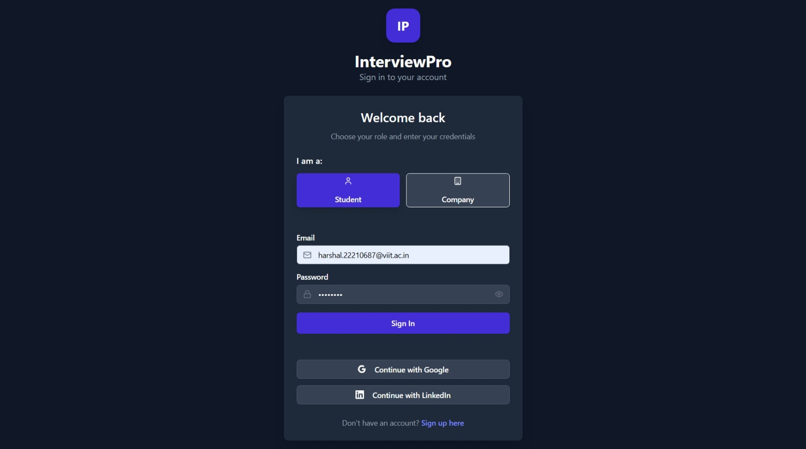
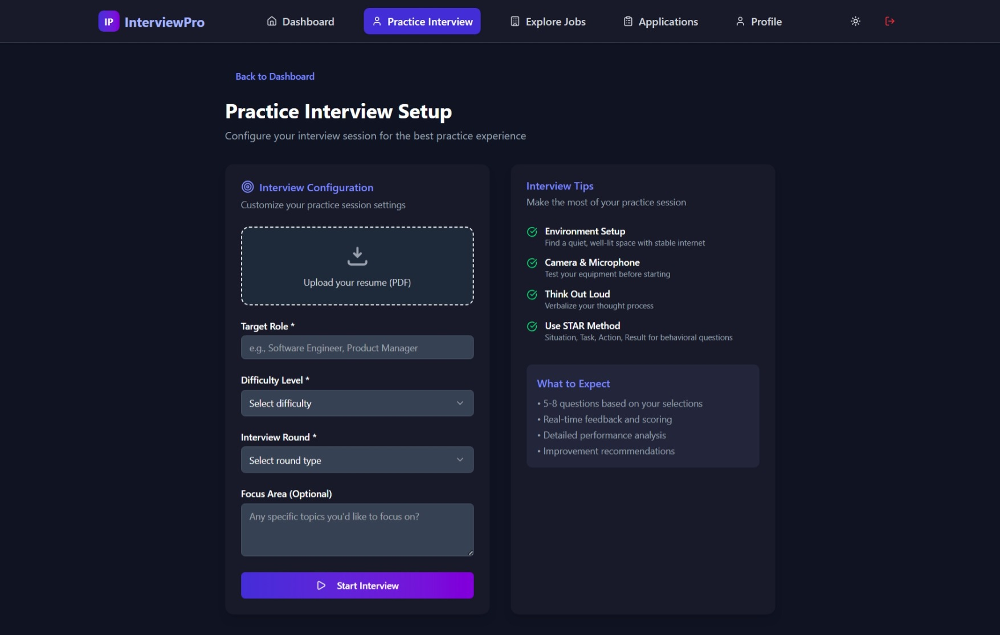
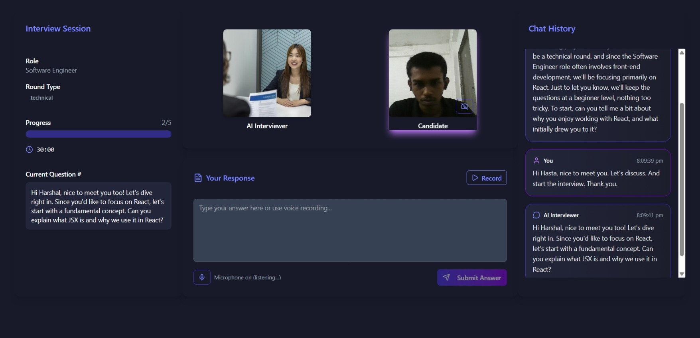
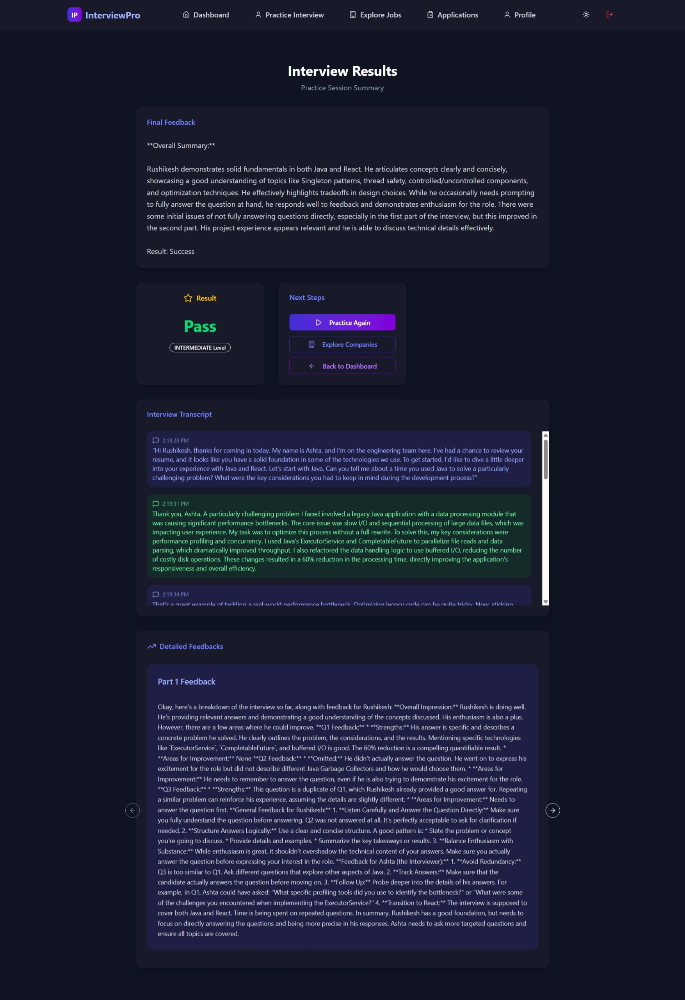
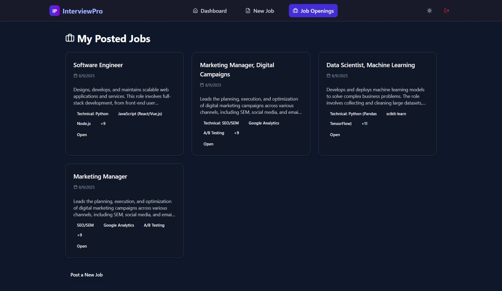

# IntelliHire – AI-Powered Interview & Hiring Platform

🔗 **Live Demo:** [IntelliHire](https://interview-ai-pual.onrender.com/)

IntelliHire is an **AI-powered interview and hiring platform** that helps:

- 🎓 **Students** practice interviews in real-time with AI-driven simulators.
- 🏢 **Companies** conduct automated hiring through AI-driven interviews and candidate evaluations.

The platform offers **customizable practice interviews**, **resume-based question generation**, **speech-to-text and text-to-speech support**, and a **round-wise automated hiring pipeline** — all in one place.

---

## 🚀 Features

- 🤖 **AI-Driven Interviews** powered by Gemini API.
- 🎤 **Real-Time Interviews** with **Web Speech API** (STT + TTS).
- 📊 **Detailed Results** – pass/fail status, feedback, transcript, and round analysis.
- ⚡ **Automated Hiring** – companies can define job rounds, AI evaluates candidates automatically.
- 🎯 **Customizable Practice Interviews** – choose topic, difficulty, or custom questions.
- 📑 **Resume Integration** – built-in **resume text extractor** for personalized interviews.
- 🌓 **Light/Dark Mode** support.

---

## 🛠️ Tech Stack

- **Frontend:** React.js, Vite, TailwindCSS
- **Backend:** Node.js, Express.js
- **AI APIs:** Gemini API
- **Speech APIs:** Web Speech API (STT & TTS)
- **Resume Parsing:** pdf.js
- **Deployment:** Render

---

## 📸 Pages Overview

### 1. **Index Page**

- Project description with **Sign In / Get Started** button.
  

### 2. **Authorization Pages**

- Login & Signup for both **Student** and **Company** users.

### 3. **Interview Page**

- **Student:** Setup form → AI-powered interview with video, chat, and questions.
- **Company Candidate:** Interview directly based on predefined job rounds.
- Opens **Result Page** after completion.

### 4. **Interview Result Page**

- Shows **Pass/Fail result**, **AI feedback**, **part-wise feedback**, and **full transcript**.

### 5. **Student Dashboard**

- Displays **total interviews**, **passed/failed/quit stats**.
- Shows **interview cards** → open detailed result.

### 6. **Job Openings Page**

- Browse available jobs.
- Apply directly or view job details.

### 7. **Job Opening Detail Page**

- Job description, required skills, interview process, and **Apply button**.

### 8. **Application Page (Student)**

- See all applications grouped by status (**Applied, In-progress, Selected, Final-Selected, Rejected**).
  

### 9. **Application Detail Page (Student)**

- Detailed application info.
- If **In-progress**, candidate can start the next round.

### 10. **Profile Page (Student)**

- View & update profile.
- Upload/change resume, view extracted text.
  

### 11. **Company Dashboard**

- Shows applications received for jobs.
- Track **selected/rejected candidates**.

### 12. **Create Job Opening Page**

- Companies create new job openings with **custom hiring rounds**.

### 13. **Company Job Openings Page**

- View all job listings by the company.
- Open job-specific applications.

### 14. **Job Application Page (Company)**

- View applications grouped by status:
  - **Applied**
  - **In-Progress**
  - **Selected**
  - **Final-Selected**
  - **Rejected**
- AI moves candidates through stages automatically.
- Final approval by company HR.

---

